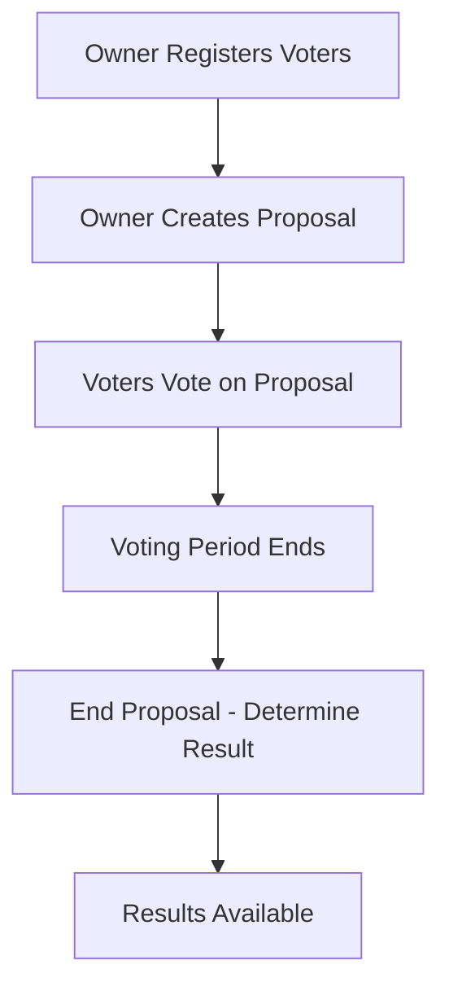

# Blockchain Voting Smart Contract Architecture Design

## Overview
This document outlines the architecture for a blockchain voting smart contract implemented in Solidity. The contract enables secure, decentralized voting on proposals with features including user registration, proposal creation, voting, and result tracking.

## Contract Structure
- **Contract Name**: VotingSystem
- **Inheritance**: Ownable (from OpenZeppelin)
- **Solidity Version**: ^0.8.24
- **License**: MIT

## Enums
- `ProposalStatus`: { Active, Ended, Passed, Rejected }

## Structs
- `Proposal`:
  - `uint256 id`
  - `string title`
  - `string description`
  - `uint256 startTime`
  - `uint256 endTime`
  - `uint256 yesVotes`
  - `uint256 noVotes`
  - `ProposalStatus status`

## State Variables
- `address public owner` (inherited from Ownable)
- `mapping(address => bool) public isRegisteredVoter`
- `uint256 public proposalCount`
- `Proposal[] public proposals`
- `mapping(uint256 => mapping(address => bool)) public hasVoted`

## Functions

### Constructor
- `constructor()`: Initializes Ownable with msg.sender as owner.

### User Registration
- `registerVoter(address _voter) public onlyOwner`:
  - Registers a voter if not already registered.
  - Emits `VoterRegistered` event.

### Proposal Creation
- `createProposal(string memory _title, string memory _description, uint256 _duration) public onlyOwner`:
  - Creates a new proposal with given title, description, and voting duration.
  - Sets startTime to block.timestamp, endTime to startTime + _duration.
  - Initializes votes to 0, status to Active.
  - Emits `ProposalCreated` event.

### Voting
- `vote(uint256 _proposalId, bool _support) public`:
  - Requires voter to be registered.
  - Requires voter has not voted on this proposal.
  - Requires proposal is Active and within voting period.
  - Increments yesVotes or noVotes based on _support.
  - Marks voter as voted.
  - Emits `Voted` event.

### Status Tracking
- `endProposal(uint256 _proposalId) public`:
  - Requires proposal is Active and voting period has ended.
  - Sets status to Passed if yesVotes > noVotes, else Rejected.
  - Emits `ProposalEnded` event.

### View Functions
- `getProposal(uint256 _id) public view returns (Proposal memory)`: Returns proposal details.
- `getVoteCounts(uint256 _id) public view returns (uint256 yes, uint256 no)`: Returns vote counts.

## Events
- `VoterRegistered(address indexed voter)`
- `ProposalCreated(uint256 indexed proposalId, string title, string description)`
- `Voted(uint256 indexed proposalId, address indexed voter, bool support)`
- `ProposalEnded(uint256 indexed proposalId, ProposalStatus status)`

## Security Considerations
- **Access Control**: Only owner can register voters and create proposals using `onlyOwner` modifier.
- **Reentrancy Protection**: No external calls, low reentrancy risk.
- **Integer Safety**: Solidity 0.8+ provides built-in overflow/underflow protection.
- **Time Dependencies**: Uses `block.timestamp` for voting periods; miners can manipulate timestamps slightly, but acceptable for this use case.
- **Denial of Service**: Gas limits may restrict large-scale voting; suitable for small to medium voter bases.
- **Front-Running**: Votes can be front-run, but one-vote-per-user prevents abuse.
- **Input Validation**: Checks for valid proposal IDs, registered voters, and voting periods.
- **Event Logging**: All state changes emit events for transparency and off-chain monitoring.

## Workflow Diagram

This design ensures a secure, transparent, and efficient voting system on the blockchain.